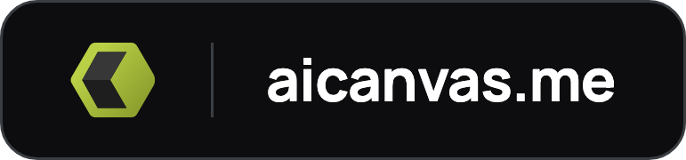

<p align="center">
  <a href="https://aicanvas.me">
    
  </a>
</p>

# AI Canvas

<p align="center">
  <a href="https://aicanvas.me" title="Browse the live catalog"></a>
</p>

<p align="center">
  <em>Finished Components, Not Headless Primitives</em>
</p>

A growing collection of animated React components, plus a token-driven design system and ready-made templates. Every component arrives as real source code in your project, with an AI remix prompt that works in any AI coding tool. Open core: the free library is MIT, and Premium is proprietary.

<p align="center">
  <a href="./LICENSE"></a>
  &nbsp;
  <a href="https://aicanvas.me"></a>
  &nbsp;
  <a href="#install"></a>
  &nbsp;
  <a href="#use-it-with-your-ai-editor-mcp"></a>
</p>

<p align="center"><sub><a href="#install">Install</a> · <a href="#components">Components</a> · <a href="#blocks">Blocks</a> · <a href="#templates">Templates</a> · <a href="#use-it-with-your-ai-editor-mcp">MCP</a> · <a href="#design-systems-and-templates">Design systems</a> · <a href="#repository-layout">Repo layout</a> · <a href="#common-questions">FAQ</a> · <a href="#license">License</a></sub></p>

## Install

Add any component to your project with one command:

```bash
npx shadcn@latest add @aicanvas/task-cards
```

Starting a new project? Initialize first, then add:

```bash
npx shadcn@latest init        # new projects only
npx shadcn@latest add @aicanvas/task-cards
```

One-command installs use a free AI Canvas account: signed out, the CLI writes a small placeholder file instead of the component. [Sign up free](https://aicanvas.me/account/sign-up), then copy your personal install command from any component page. No account needed to read the code: every free component's full MIT source lives right here in this repo.

### Three ways to use it

| Path | Command or action | Best for |
| --- | --- | --- |
| **shadcn CLI** | `npx shadcn@latest add @aicanvas/<slug>` | Dropping finished, open-source code straight into your repo |
| **AI Canvas MCP** | `npx -y @aicanvas/mcp` | Letting your AI editor search and install components for you |
| **Remix with AI** | Copy the full prompt from any free component page | Rebuilding a component your way in any AI coding tool |

Browse the full catalog and copy the exact command for any component at [aicanvas.me](https://aicanvas.me). `pnpm dlx`, `yarn dlx`, and `bunx` work too.

## Why AI Canvas

- **MIT licensed.** The free library is MIT, so you can use it in personal and commercial projects, modify it freely, and ship it without attribution. Premium components, design systems, and templates are proprietary.
- **Full source, yours to keep.** Every component arrives as real React and TypeScript code in your codebase, not a black-box dependency. Restyle it, extend it, or ship it as is. It is yours.
- **Built for AI workflows.** Install with the shadcn CLI, connect the MCP so your agent installs for you, or hand it a remix prompt that works in any AI coding tool.
- **Animated by default.** Built with Framer Motion and Tailwind CSS, ready for the Next.js App Router or any modern React setup. 3D pieces use Three.js.

## Components

<p align="center">
  <a href="https://aicanvas.me/components/tilted-coverflow"></a>
  <a href="https://aicanvas.me/components/crypto-swap"></a>
  <a href="https://aicanvas.me/components/signature-pad"></a>
  <a href="https://aicanvas.me/components/product-card-deck"></a>
  <a href="https://aicanvas.me/components/glass-ai-compose"></a>
  <a href="https://aicanvas.me/components/voice-chat-pill"></a>
  <a href="https://aicanvas.me/components/andromeda-button"></a>
</p>

<p align="center"><sub><a href="https://aicanvas.me">Browse all components at aicanvas.me</a></sub></p>

## Blocks

Composed, multi-component page sections: pricing tables, hero banners, galleries. Same install, same MIT licence, just a larger unit of work than a single component.

<p align="center">
  <a href="https://aicanvas.me/components/ai-job-cards"></a>
  <a href="https://aicanvas.me/components/scroll-wipe-gallery"></a>
  <a href="https://aicanvas.me/components/task-cards"></a>
  <a href="https://aicanvas.me/components/slide-deck"></a>
</p>

<p align="center"><sub><a href="https://aicanvas.me/components/category/blocks">Browse all blocks at aicanvas.me</a></sub></p>

## Templates

Full screens built with **Andromeda**, the AI Canvas design system. Every panel, chart, and control on these pages is an Andromeda component reading the same token bundle.

<p align="center">
  <a href="https://aicanvas.me/design-systems/andromeda/templates/mission-control"></a>
  <a href="https://aicanvas.me/design-systems/andromeda/templates/service-order"></a>
  <a href="https://aicanvas.me/design-systems/andromeda/templates/resource-planning"></a>
  <a href="https://aicanvas.me/design-systems/andromeda/templates/signal-room"></a>
</p>

<p align="center"><sub><a href="https://aicanvas.me/design-systems/andromeda">See Andromeda at aicanvas.me</a></sub></p>

## Use it with your AI editor (MCP)

Connect AI Canvas to your AI editor and let your agent search, inspect, and install components for you. Save tokens. Do not start from scratch.

```bash
claude mcp add aicanvas -- npx -y @aicanvas/mcp
```

Or add it to your MCP config:

```json
{
  "mcpServers": {
    "aicanvas": {
      "command": "npx",
      "args": ["-y", "@aicanvas/mcp"]
    }
  }
}
```

Works with Claude Code, Codex, Cursor, and other MCP-compatible editors. The server is read-only and fetches the live registry at runtime, so new components reach your agent shortly after they ship. It returns published component metadata and source.

## Design systems and templates

Beyond standalone components, AI Canvas ships **Andromeda**, a token-driven sci-fi and blueprint design system, with ready-made templates like Mission Control, Service Order, Resource Planning, and Signal Room. Installing an Andromeda component brings its source code plus the shared token bundle it depends on.

See it at [aicanvas.me/design-systems/andromeda](https://aicanvas.me/design-systems/andromeda).

## Repository layout

This repo holds the full AI Canvas source: the website **and** every free component. The component source lives here, not just the site.

| Path | What's there |
| --- | --- |
| [`components-workspace/<slug>/`](./components-workspace) | Each free component: `index.tsx` source, `prompts.ts` remix prompt, `spec.md` |
| [`design-systems/andromeda/`](./design-systems/andromeda) | The free Andromeda design system source: tokens, components, utilities |
| [`app/`](./app) | The aicanvas.me website (Next.js App Router) |
| [`scripts/generate-registry.mjs`](./scripts/generate-registry.mjs) | Builds the shadcn registry JSON from the sources above |

The `@aicanvas` registry files served at `/r/*.json` are **generated at build time** from `components-workspace/` and `design-systems/`, so there is no checked-in `registry/` folder. Run `node scripts/generate-registry.mjs` to produce them locally.

## Tech stack

React and TypeScript, Tailwind CSS, and Framer Motion. Built for the Next.js App Router and works in any modern React setup. 3D components use Three.js.

## Common Questions

**Do I need an account?**
Not to read the code. Every free component's full MIT source is in this repo, and you can copy it from any component page. A free account is only needed for the one-command `npx shadcn add` install, which writes a placeholder file when you are signed out.

**Does it work outside Next.js?**
Yes. Components are plain React and TypeScript with Tailwind and Framer Motion. The App Router is the default target, not a requirement.

**Do I get a dependency or real code?**
Real code. Installing copies the source into your project, so you own it and can change anything. There is no AI Canvas package to keep in sync.

**Can I use it commercially?**
Yes, the free library is MIT. Use it in commercial projects, modify it, and ship it without attribution. Premium components, design systems, and templates are proprietary under a separate license.

**What is the remix prompt?**
Every component ships with one comprehensive, platform-agnostic prompt. Paste it into any AI coding tool to rebuild that component your way instead of copying it as is.

**How do I keep components up to date?**
You do not have to. Once installed, the code is yours and never changes under you. Re-run the install command if you want the latest version of a component.

## Project status

AI Canvas is an actively maintained project. New components, design systems, and templates ship regularly. If AI Canvas saves you time, a star helps more builders find it.

## Contributing

AI Canvas is open source under MIT. Issues, ideas, and pull requests are welcome. Open an issue to suggest a component or report a bug.

## License

The free library is MIT licensed. Use it in personal and commercial projects, modify it freely, and ship it without attribution. See [LICENSE](./LICENSE). Premium components, design systems, and templates are proprietary under the AI Canvas Premium License.
